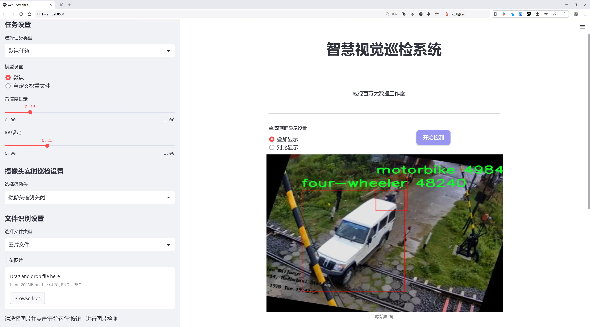
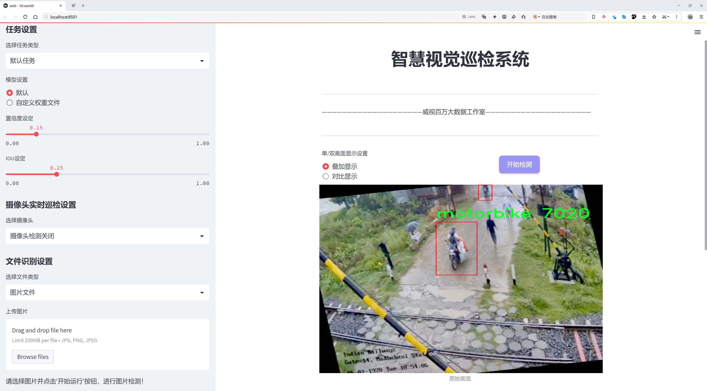
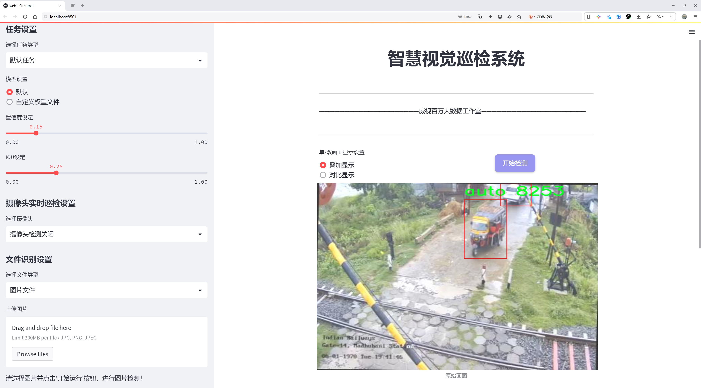
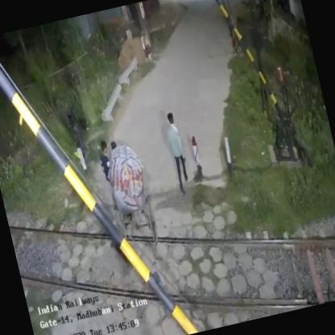
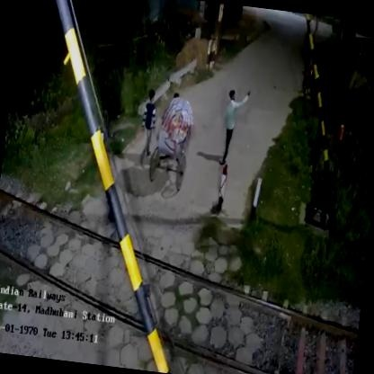
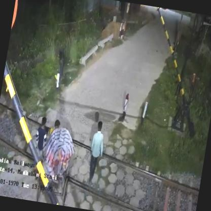
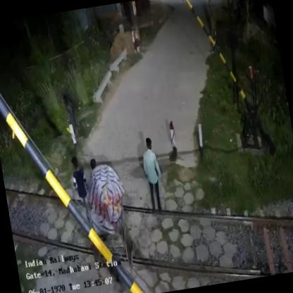
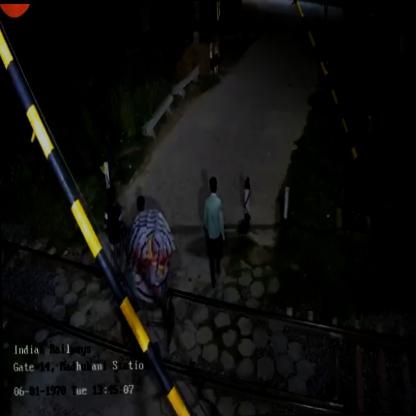

# 铁路道口交通工具检测检测系统源码分享
 # [一条龙教学YOLOV8标注好的数据集一键训练_70+全套改进创新点发刊_Web前端展示]

### 1.研究背景与意义

项目参考[AAAI Association for the Advancement of Artificial Intelligence](https://gitee.com/qunshansj/projects)

项目来源[AACV Association for the Advancement of Computer Vision](https://gitee.com/qunmasj/projects)

研究背景与意义

随着城市化进程的加快，交通流量的急剧增加使得交通安全问题日益突出，尤其是在铁路道口这一特殊的交通节点。铁路道口是铁路与公路交叉的地方，往往是交通事故的高发区域。根据统计数据，铁路道口事故不仅造成了人员伤亡，还对交通运输效率造成了严重影响。因此，如何有效地监测和管理铁路道口的交通流量，尤其是对各种交通工具的实时检测，成为了亟待解决的课题。

近年来，计算机视觉技术的迅猛发展为交通工具检测提供了新的解决方案。YOLO（You Only Look Once）系列模型因其高效的实时检测能力，逐渐成为物体检测领域的主流方法。YOLOv8作为该系列的最新版本，进一步提升了检测精度和速度，适用于复杂的交通场景。然而，现有的YOLOv8模型在特定应用场景下仍存在一定的局限性，尤其是在铁路道口这种具有特殊背景和多样化交通工具的环境中。因此，基于改进YOLOv8的铁路道口交通工具检测系统的研究显得尤为重要。

本研究将构建一个基于改进YOLOv8的铁路道口交通工具检测系统，旨在提高对铁路道口交通工具的检测精度和实时性。我们将使用5600张图像的数据集，涵盖了8类交通工具，包括汽车、公交车、四轮车、摩托车、SUV、拖拉机等。这些数据不仅丰富了模型的训练样本，也为其在实际应用中的泛化能力提供了保障。通过对不同交通工具的特征进行深入分析，改进YOLOv8模型的网络结构和参数设置，以适应铁路道口复杂的交通环境，从而实现高效、准确的交通工具检测。

本研究的意义不仅在于提升铁路道口的交通安全管理水平，更在于为智能交通系统的建设提供技术支持。通过实时监测和分析铁路道口的交通流量，相关部门可以及时采取措施，优化交通信号控制，减少交通拥堵，降低事故发生率。此外，研究成果还可为其他交通场景的物体检测提供借鉴，推动计算机视觉技术在交通领域的广泛应用。

综上所述，基于改进YOLOv8的铁路道口交通工具检测系统的研究，不仅具有重要的理论价值，也具备广泛的实际应用前景。通过本研究，我们希望能够为铁路道口的交通安全管理提供有效的技术手段，推动智能交通的发展，为实现安全、高效的交通环境贡献力量。

### 2.图片演示







##### 注意：由于此博客编辑较早，上面“2.图片演示”和“3.视频演示”展示的系统图片或者视频可能为老版本，新版本在老版本的基础上升级如下：（实际效果以升级的新版本为准）

  （1）适配了YOLOV8的“目标检测”模型和“实例分割”模型，通过加载相应的权重（.pt）文件即可自适应加载模型。

  （2）支持“图片识别”、“视频识别”、“摄像头实时识别”三种识别模式。

  （3）支持“图片识别”、“视频识别”、“摄像头实时识别”三种识别结果保存导出，解决手动导出（容易卡顿出现爆内存）存在的问题，识别完自动保存结果并导出到tempDir中。

  （4）支持Web前端系统中的标题、背景图等自定义修改，后面提供修改教程。

  另外本项目提供训练的数据集和训练教程,暂不提供权重文件（best.pt）,需要您按照教程进行训练后实现图片演示和Web前端界面演示的效果。

### 3.视频演示

[3.1 视频演示](https://www.bilibili.com/video/BV1rU44euEBZ/)

### 4.数据集信息展示

##### 4.1 本项目数据集详细数据（类别数＆类别名）

nc: 8
names: ['auto', 'bus', 'car', 'four-wheeler', 'motorbike', 'suv', 'toto', 'tractor']


##### 4.2 本项目数据集信息介绍

数据集信息展示

在现代交通管理与安全监控领域，铁路道口的交通工具检测系统扮演着至关重要的角色。为提升这一系统的准确性与效率，我们构建了一个专门的数据集——“cctv-model”，旨在为改进YOLOv8模型提供丰富的训练数据。该数据集的设计充分考虑了铁路道口的交通环境，涵盖了多种常见的交通工具，确保模型在实际应用中的高效性与可靠性。

“cctv-model”数据集包含8个类别，具体类别包括：自动车（auto）、公交车（bus）、小轿车（car）、四轮车（four-wheeler）、摩托车（motorbike）、运动型多用途车（suv）、三轮车（toto）以及拖拉机（tractor）。这些类别的选择不仅反映了铁路道口周边的交通现状，也为模型的多样性与适应性提供了坚实的基础。每个类别的交通工具在外观、尺寸和行驶特性上均存在显著差异，这为模型的训练提供了丰富的样本，有助于提高其对不同交通工具的识别能力。

在数据集的构建过程中，我们通过多种途径收集了大量的图像数据，确保每个类别都有足够的样本量。这些图像来源于不同的铁路道口监控摄像头，涵盖了不同时间段和天气条件下的交通情况。这种多样性不仅增强了数据集的代表性，也为模型的泛化能力奠定了基础。为了保证数据的标注质量，我们采用了严格的标注流程，确保每张图像中的交通工具都被准确地标注，减少了误差和偏差。

在训练过程中，YOLOv8模型将利用“cctv-model”数据集中的标注信息进行学习。该模型以其高效的特征提取能力和实时检测性能，能够快速识别出图像中的交通工具，并为每个类别分配相应的置信度分数。通过不断迭代训练，模型将逐步提高对不同交通工具的识别精度，从而实现对铁路道口交通流量的实时监控与管理。

此外，为了进一步提升模型的性能，我们还计划对数据集进行增强处理，包括图像的旋转、缩放、裁剪和颜色调整等。这些数据增强技术将帮助模型在面对各种复杂场景时，依然能够保持良好的识别能力。通过这种方式，我们希望“cctv-model”不仅能够提高YOLOv8在铁路道口交通工具检测中的表现，还能为未来的智能交通系统提供有力支持。

总之，“cctv-model”数据集的构建是一个系统化的过程，旨在为铁路道口交通工具检测系统的优化提供坚实的数据基础。通过对8个交通工具类别的全面覆盖和高质量的标注，我们相信该数据集将为YOLOv8模型的训练带来显著的提升，最终实现更安全、更高效的铁路道口交通管理。











### 5.全套项目环境部署视频教程（零基础手把手教学）

[5.1 环境部署教程链接（零基础手把手教学）](https://www.ixigua.com/7404473917358506534?logTag=c807d0cbc21c0ef59de5)


[5.2 安装Python虚拟环境创建和依赖库安装视频教程链接（零基础手把手教学）](https://www.ixigua.com/7404474678003106304?logTag=1f1041108cd1f708b01a)

### 6.手把手YOLOV8训练视频教程（零基础小白有手就能学会）

[6.1 手把手YOLOV8训练视频教程（零基础小白有手就能学会）](https://www.ixigua.com/7404477157818401292?logTag=d31a2dfd1983c9668658)

### 7.70+种全套YOLOV8创新点代码加载调参视频教程（一键加载写好的改进模型的配置文件）

[7.1 70+种全套YOLOV8创新点代码加载调参视频教程（一键加载写好的改进模型的配置文件）](https://www.ixigua.com/7404478314661806627?logTag=29066f8288e3f4eea3a4)

### 8.70+种全套YOLOV8创新点原理讲解（非科班也可以轻松写刊发刊，V10版本正在科研待更新）

由于篇幅限制，每个创新点的具体原理讲解就不一一展开，具体见下列网址中的创新点对应子项目的技术原理博客网址【Blog】：


[8.1 70+种全套YOLOV8创新点原理讲解链接](https://gitee.com/qunmasj/good)

### 9.系统功能展示（检测对象为举例，实际内容以本项目数据集为准）

图9.1.系统支持检测结果表格显示

  图9.2.系统支持置信度和IOU阈值手动调节

  图9.3.系统支持自定义加载权重文件best.pt(需要你通过步骤5中训练获得)

  图9.4.系统支持摄像头实时识别

  图9.5.系统支持图片识别

  图9.6.系统支持视频识别

  图9.7.系统支持识别结果文件自动保存

  图9.8.系统支持Excel导出检测结果数据


### 10.原始YOLOV8算法原理

原始YOLOv8算法原理

YOLOv8算法是目标检测领域的一次重要突破，其设计理念和实现方法体现了深度学习技术的最新进展。作为YOLO系列的最新版本，YOLOv8不仅继承了前几代算法的优点，还在多个方面进行了创新和优化，使其在精度和速度上都表现出色。该算法的核心思想在于通过高效的特征提取和融合机制，结合先进的损失计算策略，来实现对目标的精准检测。

首先，YOLOv8在骨干网络的设计上延续了跨级结构（Cross Stage Partial, CSP）的思想，但在此基础上进行了优化。具体而言，YOLOv8将YOLOv5中的C3模块替换为C2f模块，这一变化不仅减轻了模型的复杂度，还提升了特征提取的效率。C2f模块通过将特征提取过程分为卷积和连接两部分，能够更好地保持梯度流动，从而有效避免了深层网络中的梯度消失问题。这种设计使得YOLOv8在进行特征提取时，能够获得更丰富的特征信息，为后续的目标检测提供了坚实的基础。

在特征融合方面，YOLOv8采用了PAN-FPN（Path Aggregation Network - Feature Pyramid Network）结构，这一结构的设计旨在通过多尺度特征的融合，提升模型对不同尺寸目标的检测能力。PAN-FPN通过结合语义特征和定位特征，进一步增强了网络的特征融合能力，使得YOLOv8在处理复杂场景时，能够更好地捕捉到目标的细节信息。此外，YOLOv8在颈部网络中引入了SPPF（Spatial Pyramid Pooling Fast）模块，通过不同内核尺寸的池化操作，进一步提高了模型的计算速度和特征图的表达能力。

YOLOv8的检测模块采用了Anchor-Free的检测方式，这一创新使得模型在进行目标检测时，不再依赖于预定义的锚框，从而简化了模型的设计和训练过程。通过解耦头结构，YOLOv8将回归分支和预测分支进行了分离，这不仅加速了模型的收敛速度，还提高了检测的精度。解耦头结构的设计使得模型能够更灵活地处理不同类型的目标，进一步提升了检测的鲁棒性。

在损失计算策略上，YOLOv8引入了变焦损失（Focal Loss）来计算分类损失，这一策略有效地解决了类别不平衡问题，使得模型在面对难以检测的目标时，能够给予更多的关注。此外，YOLOv8还采用了数据平均保真度损失和完美交并比损失来计算边界框损失，这种多维度的损失计算方式，使得模型在边界框的回归上更加准确，从而提升了目标检测的整体性能。

YOLOv8的设计不仅关注模型的精度，还兼顾了其计算效率。通过对网络结构的轻量化设计，YOLOv8能够在保持高精度的同时，显著降低计算资源的消耗。这一特性使得YOLOv8在实际应用中，能够更好地适应各种设备的运行环境，无论是在高性能服务器上，还是在资源受限的移动设备上，YOLOv8都能提供出色的检测性能。

总的来说，YOLOv8算法通过对骨干网络、特征融合、检测模块及损失计算策略的全面优化，成功实现了高效且准确的目标检测。其在多方面的创新，不仅提升了模型的性能，也为后续的研究和应用提供了新的思路和方向。随着YOLOv8的不断发展和完善，未来在目标检测领域的应用将更加广泛，推动着智能视觉技术的进一步进步。


### 11.项目核心源码讲解（再也不用担心看不懂代码逻辑）

#### 11.1 ui.py

以下是经过简化和注释的核心代码部分：

```python
import sys
import subprocess
from QtFusion.path import abs_path

def run_script(script_path):
    """
    使用当前 Python 环境运行指定的脚本。

    Args:
        script_path (str): 要运行的脚本路径
    """
    # 获取当前 Python 解释器的路径
    python_path = sys.executable

    # 构建运行命令，使用 streamlit 运行指定的脚本
    command = f'"{python_path}" -m streamlit run "{script_path}"'

    # 执行命令并获取结果
    result = subprocess.run(command, shell=True)
    
    # 检查命令执行结果，如果返回码不为0，表示出错
    if result.returncode != 0:
        print("脚本运行出错。")

# 主程序入口
if __name__ == "__main__":
    # 获取脚本的绝对路径
    script_path = abs_path("web.py")

    # 运行指定的脚本
    run_script(script_path)
```

### 代码说明：
1. **导入模块**：
   - `sys`：用于获取当前 Python 解释器的路径。
   - `subprocess`：用于执行外部命令。
   - `abs_path`：从 `QtFusion.path` 模块导入的函数，用于获取文件的绝对路径。

2. **`run_script` 函数**：
   - 接受一个参数 `script_path`，表示要运行的 Python 脚本的路径。
   - 使用 `sys.executable` 获取当前 Python 解释器的路径。
   - 构建命令字符串，使用 `streamlit` 模块运行指定的脚本。
   - 使用 `subprocess.run` 执行命令，并检查返回码以判断脚本是否成功运行。

3. **主程序入口**：
   - 在 `__main__` 模块中，获取 `web.py` 脚本的绝对路径。
   - 调用 `run_script` 函数来运行该脚本。

这个文件是一个 Python 脚本，主要用于运行一个名为 `web.py` 的 Streamlit 应用。首先，文件导入了必要的模块，包括 `sys`、`os` 和 `subprocess`，这些模块提供了与系统交互的功能。特别是 `subprocess` 模块用于在 Python 中执行外部命令。

接下来，定义了一个名为 `run_script` 的函数，该函数接受一个参数 `script_path`，表示要运行的脚本的路径。在函数内部，首先获取当前 Python 解释器的路径，这通过 `sys.executable` 实现。然后，构建一个命令字符串，该命令使用当前的 Python 解释器和 Streamlit 模块来运行指定的脚本。命令的格式是 `"{python_path}" -m streamlit run "{script_path}"`，其中 `python_path` 是 Python 解释器的路径，`script_path` 是要运行的脚本路径。

接着，使用 `subprocess.run` 方法执行构建好的命令。这个方法会在一个新的 shell 中运行命令，并等待命令执行完成。如果命令的返回码不为 0，表示脚本运行过程中出现了错误，此时会打印出“脚本运行出错”的提示信息。

在文件的最后部分，使用 `if __name__ == "__main__":` 语句来确保只有在直接运行该脚本时才会执行以下代码。在这里，指定了要运行的脚本路径为 `web.py`，并调用 `run_script` 函数来执行这个脚本。

总的来说，这个文件的主要功能是通过当前的 Python 环境来运行一个 Streamlit 应用，提供了一种简单的方式来启动和管理这个应用。

#### 11.2 70+种YOLOv8算法改进源码大全和调试加载训练教程（非必要）\ultralytics\models\nas\__init__.py

以下是代码中最核心的部分，并附上详细的中文注释：

```python
# 导入必要的模块和类
from .model import NAS  # 从当前包的model模块中导入NAS类
from .predict import NASPredictor  # 从当前包的predict模块中导入NASPredictor类
from .val import NASValidator  # 从当前包的val模块中导入NASValidator类

# 定义当前模块的公开接口
__all__ = 'NASPredictor', 'NASValidator', 'NAS'  # 指定当使用from module import *时，公开的类和函数
```

### 注释说明：
1. **导入模块**：
   - `from .model import NAS`：从当前包的`model`模块中导入`NAS`类，`NAS`可能是一个神经网络架构或模型的定义。
   - `from .predict import NASPredictor`：从当前包的`predict`模块中导入`NASPredictor`类，`NASPredictor`可能用于进行模型预测的功能。
   - `from .val import NASValidator`：从当前包的`val`模块中导入`NASValidator`类，`NASValidator`可能用于验证模型性能的功能。

2. **定义公开接口**：
   - `__all__`是一个特殊变量，用于定义当前模块中可以被外部访问的类和函数。当使用`from module import *`时，只会导入`__all__`中列出的内容。这有助于控制模块的公共API，避免不必要的名称冲突。

这个程序文件是Ultralytics YOLO（You Only Look Once）项目的一部分，主要涉及到神经架构搜索（NAS，Neural Architecture Search）相关的功能模块。文件的开头包含了版权信息，表明该代码遵循AGPL-3.0许可证。

在文件中，首先从同一目录下导入了三个重要的类：`NAS`、`NASPredictor`和`NASValidator`。这些类分别代表了神经架构搜索的模型、预测器和验证器。具体来说，`NAS`类可能用于定义和构建神经网络模型，而`NASPredictor`则用于进行模型的预测，`NASValidator`则用于验证模型的性能。

最后，`__all__`变量被定义为一个元组，包含了这三个类的名称。这意味着当使用`from module import *`的方式导入该模块时，只会导入`NASPredictor`、`NASValidator`和`NAS`这三个类。这是一种控制模块导出内容的方式，确保只暴露特定的接口给外部使用。

总的来说，这个文件是Ultralytics YOLO项目中关于NAS功能的一个初始化模块，负责导入和管理与神经架构搜索相关的核心组件。

#### 11.3 code\ultralytics\utils\callbacks\tensorboard.py

以下是代码中最核心的部分，并附上详细的中文注释：

```python
# 导入必要的库
from ultralytics.utils import LOGGER, SETTINGS, TESTS_RUNNING, colorstr

try:
    # 尝试导入TensorBoard的SummaryWriter，用于记录训练过程中的数据
    from torch.utils.tensorboard import SummaryWriter

    # 确保当前不是在测试运行中
    assert not TESTS_RUNNING  
    # 确保TensorBoard集成已启用
    assert SETTINGS["tensorboard"] is True  
    WRITER = None  # 初始化TensorBoard的SummaryWriter实例

except (ImportError, AssertionError, TypeError, AttributeError):
    # 处理导入错误或断言错误
    SummaryWriter = None  # 如果导入失败，则将SummaryWriter设置为None


def _log_scalars(scalars, step=0):
    """将标量值记录到TensorBoard中。"""
    if WRITER:  # 如果WRITER存在
        for k, v in scalars.items():  # 遍历标量字典
            WRITER.add_scalar(k, v, step)  # 记录每个标量值


def _log_tensorboard_graph(trainer):
    """将模型图记录到TensorBoard中。"""
    try:
        import warnings
        from ultralytics.utils.torch_utils import de_parallel, torch

        imgsz = trainer.args.imgsz  # 获取输入图像的大小
        imgsz = (imgsz, imgsz) if isinstance(imgsz, int) else imgsz  # 确保图像大小是一个元组
        p = next(trainer.model.parameters())  # 获取模型参数以确定设备和类型
        im = torch.zeros((1, 3, *imgsz), device=p.device, dtype=p.dtype)  # 创建一个全零的输入图像
        with warnings.catch_warnings():
            warnings.simplefilter("ignore", category=UserWarning)  # 忽略JIT跟踪警告
            WRITER.add_graph(torch.jit.trace(de_parallel(trainer.model), im, strict=False), [])  # 记录模型图
    except Exception as e:
        LOGGER.warning(f"WARNING ⚠️ TensorBoard图形可视化失败 {e}")  # 记录警告信息


def on_pretrain_routine_start(trainer):
    """初始化TensorBoard记录，使用SummaryWriter。"""
    if SummaryWriter:  # 如果SummaryWriter可用
        try:
            global WRITER
            WRITER = SummaryWriter(str(trainer.save_dir))  # 创建SummaryWriter实例
            prefix = colorstr("TensorBoard: ")
            LOGGER.info(f"{prefix}使用 'tensorboard --logdir {trainer.save_dir}' 启动，查看地址为 http://localhost:6006/")
        except Exception as e:
            LOGGER.warning(f"WARNING ⚠️ TensorBoard未正确初始化，未记录此次运行。 {e}")  # 记录警告信息


def on_train_start(trainer):
    """记录TensorBoard图形。"""
    if WRITER:  # 如果WRITER存在
        _log_tensorboard_graph(trainer)  # 记录模型图


def on_train_epoch_end(trainer):
    """在训练周期结束时记录标量统计信息。"""
    _log_scalars(trainer.label_loss_items(trainer.tloss, prefix="train"), trainer.epoch + 1)  # 记录训练损失
    _log_scalars(trainer.lr, trainer.epoch + 1)  # 记录学习率


def on_fit_epoch_end(trainer):
    """在训练周期结束时记录周期指标。"""
    _log_scalars(trainer.metrics, trainer.epoch + 1)  # 记录训练指标


# 定义回调函数
callbacks = (
    {
        "on_pretrain_routine_start": on_pretrain_routine_start,
        "on_train_start": on_train_start,
        "on_fit_epoch_end": on_fit_epoch_end,
        "on_train_epoch_end": on_train_epoch_end,
    }
    if SummaryWriter  # 如果SummaryWriter可用
    else {}
)
```

### 代码核心部分说明：
1. **TensorBoard的初始化与使用**：代码尝试导入`SummaryWriter`，并在训练过程中使用它记录各种标量（如损失和学习率）和模型图。
2. **记录标量**：`_log_scalars`函数用于将训练过程中的标量数据记录到TensorBoard。
3. **记录模型图**：`_log_tensorboard_graph`函数用于将模型的计算图记录到TensorBoard，以便可视化模型结构。
4. **回调函数**：通过定义回调函数，在训练的不同阶段（如开始训练、每个周期结束等）执行相应的记录操作。

这个程序文件是用于集成 TensorBoard 日志记录功能的，主要用于 Ultralytics YOLO 模型的训练过程中的可视化。文件首先尝试导入 `torch.utils.tensorboard` 中的 `SummaryWriter`，这是 TensorBoard 的一个核心组件，用于记录和保存训练过程中的各种指标和图形。

在导入时，程序会进行一些断言检查，确保当前不是在运行测试（`TESTS_RUNNING` 为 False），并且 TensorBoard 集成已启用（`SETTINGS["tensorboard"]` 为 True）。如果导入失败或断言失败，则会将 `SummaryWriter` 设置为 None，以避免后续调用时报错。

文件中定义了几个主要的函数：

1. `_log_scalars(scalars, step=0)`：这个函数用于将标量值记录到 TensorBoard 中。它接收一个字典 `scalars`，其中包含要记录的标量数据和当前的训练步数 `step`。如果 `WRITER` 存在，就会遍历字典并将每个标量值添加到 TensorBoard。

2. `_log_tensorboard_graph(trainer)`：这个函数用于将模型的计算图记录到 TensorBoard。它首先获取输入图像的大小，并创建一个全零的张量作为输入。然后使用 `torch.jit.trace` 对模型进行跟踪，并将生成的图形添加到 TensorBoard。如果过程中出现异常，会记录警告信息。

3. `on_pretrain_routine_start(trainer)`：这个回调函数在预训练例程开始时被调用，用于初始化 TensorBoard 的日志记录。它会创建一个 `SummaryWriter` 实例，并记录 TensorBoard 的启动信息。

4. `on_train_start(trainer)`：在训练开始时调用，主要用于记录模型的计算图。

5. `on_train_epoch_end(trainer)`：在每个训练周期结束时调用，记录训练损失和学习率等标量统计信息。

6. `on_fit_epoch_end(trainer)`：在训练周期结束时调用，记录训练过程中计算的指标。

最后，文件定义了一个 `callbacks` 字典，其中包含了上述回调函数的映射关系。如果 `SummaryWriter` 可用，则这些回调函数会被注册；否则，字典为空。这种设计使得在没有 TensorBoard 支持的情况下，程序仍然能够正常运行而不会出错。

#### 11.4 code\ultralytics\models\rtdetr\val.py

以下是经过简化和注释的核心代码部分：

```python
import torch
from ultralytics.data import YOLODataset
from ultralytics.models.yolo.detect import DetectionValidator
from ultralytics.utils import ops

class RTDETRDataset(YOLODataset):
    """
    RT-DETR数据集类，继承自YOLODataset类。
    该类专为RT-DETR目标检测模型设计，优化了实时检测和跟踪任务。
    """

    def __init__(self, *args, data=None, **kwargs):
        """初始化RTDETRDataset类，调用父类构造函数。"""
        super().__init__(*args, data=data, **kwargs)

    def load_image(self, i, rect_mode=False):
        """加载数据集中索引为'i'的图像，返回图像及其调整后的尺寸。"""
        return super().load_image(i=i, rect_mode=rect_mode)

    def build_transforms(self, hyp=None):
        """构建数据增强变换，主要用于评估阶段。"""
        transforms = []
        # 如果启用数据增强，构建相应的变换
        if self.augment:
            transforms = v8_transforms(self, self.imgsz, hyp, stretch=True)
        # 添加格式化变换
        transforms.append(
            Format(
                bbox_format="xywh",  # 边界框格式
                normalize=True,  # 归一化
                return_mask=self.use_segments,  # 是否返回分割掩码
                return_keypoint=self.use_keypoints,  # 是否返回关键点
                batch_idx=True,  # 返回批次索引
                mask_ratio=hyp.mask_ratio,  # 掩码比例
                mask_overlap=hyp.overlap_mask,  # 掩码重叠
            )
        )
        return transforms


class RTDETRValidator(DetectionValidator):
    """
    RTDETRValidator类，扩展了DetectionValidator类，为RT-DETR模型提供验证功能。
    该类允许构建RTDETR特定的数据集进行验证，并应用非极大值抑制进行后处理。
    """

    def build_dataset(self, img_path, mode="val", batch=None):
        """
        构建RTDETR数据集。

        Args:
            img_path (str): 图像文件夹路径。
            mode (str): 模式（训练或验证），可自定义不同的增强。
            batch (int, optional): 批次大小。
        """
        return RTDETRDataset(
            img_path=img_path,
            imgsz=self.args.imgsz,
            batch_size=batch,
            augment=False,  # 不进行增强
            hyp=self.args,
            rect=False,  # 不使用矩形模式
            cache=self.args.cache or None,
            data=self.data,
        )

    def postprocess(self, preds):
        """对预测输出应用非极大值抑制。"""
        bs, _, nd = preds[0].shape  # 获取批次大小、通道数和预测数量
        bboxes, scores = preds[0].split((4, nd - 4), dim=-1)  # 分离边界框和分数
        bboxes *= self.args.imgsz  # 将边界框调整到原始图像大小
        outputs = [torch.zeros((0, 6), device=bboxes.device)] * bs  # 初始化输出
        for i, bbox in enumerate(bboxes):
            bbox = ops.xywh2xyxy(bbox)  # 转换边界框格式
            score, cls = scores[i].max(-1)  # 获取最大分数和类别
            pred = torch.cat([bbox, score[..., None], cls[..., None]], dim=-1)  # 合并边界框、分数和类别
            pred = pred[score.argsort(descending=True)]  # 按分数排序
            outputs[i] = pred  # 保存结果

        return outputs

    def _prepare_batch(self, si, batch):
        """准备训练或推理的批次，应用变换。"""
        idx = batch["batch_idx"] == si  # 获取当前批次索引
        cls = batch["cls"][idx].squeeze(-1)  # 获取类别
        bbox = batch["bboxes"][idx]  # 获取边界框
        ori_shape = batch["ori_shape"][si]  # 获取原始图像尺寸
        imgsz = batch["img"].shape[2:]  # 获取图像尺寸
        ratio_pad = batch["ratio_pad"][si]  # 获取填充比例
        if len(cls):
            bbox = ops.xywh2xyxy(bbox)  # 转换目标框格式
            bbox[..., [0, 2]] *= ori_shape[1]  # 转换到原始空间
            bbox[..., [1, 3]] *= ori_shape[0]  # 转换到原始空间
        return dict(cls=cls, bbox=bbox, ori_shape=ori_shape, imgsz=imgsz, ratio_pad=ratio_pad)

    def _prepare_pred(self, pred, pbatch):
        """准备并返回转换后的边界框和类别标签的批次。"""
        predn = pred.clone()  # 克隆预测
        predn[..., [0, 2]] *= pbatch["ori_shape"][1] / self.args.imgsz  # 转换到原始空间
        predn[..., [1, 3]] *= pbatch["ori_shape"][0] / self.args.imgsz  # 转换到原始空间
        return predn.float()  # 返回浮点型预测
```

### 代码注释说明：
1. **RTDETRDataset**: 这是一个专门为RT-DETR模型设计的数据集类，继承自YOLODataset。它实现了图像加载和数据增强的功能。
2. **load_image**: 该方法用于加载指定索引的图像，并返回图像及其调整后的尺寸。
3. **build_transforms**: 构建数据增强的变换，主要用于评估阶段，返回格式化的变换。
4. **RTDETRValidator**: 这是一个验证器类，扩展了DetectionValidator，专门用于RT-DETR模型的验证。
5. **build_dataset**: 构建RTDETR数据集，允许用户自定义训练和验证模式。
6. **postprocess**: 对模型的预测结果应用非极大值抑制，返回处理后的边界框和类别信息。
7. **_prepare_batch**: 准备训练或推理的批次，应用必要的变换。
8. **_prepare_pred**: 准备并返回转换后的预测结果。

这个程序文件是用于实现RT-DETR（实时检测与跟踪）模型的验证功能，主要包含两个类：`RTDETRDataset`和`RTDETRValidator`。文件首先导入了必要的库和模块，包括PyTorch和Ultralytics库中的一些功能。

`RTDETRDataset`类继承自`YOLODataset`类，专门为RT-DETR模型设计，优化了实时检测和跟踪任务。该类的构造函数调用了父类的构造函数，并提供了加载图像和构建变换的方法。`load_image`方法用于从数据集中加载单张图像，并返回图像及其调整后的尺寸。`build_transforms`方法则用于构建图像变换，主要用于评估阶段，支持多种数据增强选项。

`RTDETRValidator`类继承自`DetectionValidator`类，提供了针对RT-DETR模型的验证功能。该类能够构建特定于RT-DETR的数据集，应用非极大值抑制（NMS）进行后处理，并更新评估指标。`build_dataset`方法用于构建RT-DETR数据集，接收图像路径、模式（训练或验证）和批次大小等参数。`postprocess`方法实现了对预测输出的非极大值抑制，处理后返回经过筛选的边界框和分数。`_prepare_batch`和`_prepare_pred`方法分别用于准备训练或推理的批次数据，以及处理和返回变换后的边界框和类别标签。

整体来看，这个文件为RT-DETR模型的验证提供了必要的工具和方法，支持实时检测与跟踪任务的评估。

#### 11.5 code\ultralytics\nn\modules\block.py

以下是经过简化和注释的核心代码部分，主要保留了 YOLO 模型中的重要模块及其功能：

```python
import torch
import torch.nn as nn
import torch.nn.functional as F

class DFL(nn.Module):
    """
    分布焦点损失（DFL）模块。
    该模块用于计算目标检测中的焦点损失。
    """

    def __init__(self, c1=16):
        """初始化卷积层，输入通道数为 c1。"""
        super().__init__()
        # 创建一个卷积层，将 c1 通道的输入映射到 1 通道的输出
        self.conv = nn.Conv2d(c1, 1, 1, bias=False).requires_grad_(False)
        # 初始化卷积层的权重为 0 到 c1 的范围
        x = torch.arange(c1, dtype=torch.float)
        self.conv.weight.data[:] = nn.Parameter(x.view(1, c1, 1, 1))
        self.c1 = c1

    def forward(self, x):
        """前向传播，应用卷积层并返回结果。"""
        b, c, a = x.shape  # b: batch size, c: channels, a: anchors
        # 将输入 x 进行形状变换并通过卷积层，最后返回结果
        return self.conv(x.view(b, 4, self.c1, a).transpose(2, 1).softmax(1)).view(b, 4, a)


class Proto(nn.Module):
    """YOLOv8 掩膜原型模块，用于分割模型。"""

    def __init__(self, c1, c_=256, c2=32):
        """初始化 YOLOv8 掩膜原型模块，指定原型和掩膜的数量。"""
        super().__init__()
        self.cv1 = Conv(c1, c_, k=3)  # 第一个卷积层
        self.upsample = nn.ConvTranspose2d(c_, c_, 2, 2, 0, bias=True)  # 上采样层
        self.cv2 = Conv(c_, c_, k=3)  # 第二个卷积层
        self.cv3 = Conv(c_, c2)  # 第三个卷积层

    def forward(self, x):
        """通过上采样和卷积层进行前向传播。"""
        return self.cv3(self.cv2(self.upsample(self.cv1(x))))


class HGStem(nn.Module):
    """
    PPHGNetV2 的 StemBlock，包含 5 个卷积层和一个最大池化层。
    """

    def __init__(self, c1, cm, c2):
        """初始化 StemBlock，指定输入输出通道。"""
        super().__init__()
        self.stem1 = Conv(c1, cm, 3, 2, act=nn.ReLU())  # 第一个卷积层
        self.stem2a = Conv(cm, cm // 2, 2, 1, 0, act=nn.ReLU())  # 第二个卷积层
        self.stem2b = Conv(cm // 2, cm, 2, 1, 0, act=nn.ReLU())  # 第三个卷积层
        self.stem3 = Conv(cm * 2, cm, 3, 2, act=nn.ReLU())  # 第四个卷积层
        self.stem4 = Conv(cm, c2, 1, 1, act=nn.ReLU())  # 第五个卷积层
        self.pool = nn.MaxPool2d(kernel_size=2, stride=1, padding=0, ceil_mode=True)  # 最大池化层

    def forward(self, x):
        """前向传播，经过多个卷积层和池化层。"""
        x = self.stem1(x)
        x = F.pad(x, [0, 1, 0, 1])  # 填充
        x2 = self.stem2a(x)
        x2 = F.pad(x2, [0, 1, 0, 1])  # 填充
        x2 = self.stem2b(x2)
        x1 = self.pool(x)  # 池化
        x = torch.cat([x1, x2], dim=1)  # 拼接
        x = self.stem3(x)
        x = self.stem4(x)
        return x


class Bottleneck(nn.Module):
    """标准瓶颈模块。"""

    def __init__(self, c1, c2, shortcut=True, g=1, k=(3, 3), e=0.5):
        """初始化瓶颈模块，指定输入输出通道、是否使用快捷连接等参数。"""
        super().__init__()
        c_ = int(c2 * e)  # 隐藏通道数
        self.cv1 = Conv(c1, c_, k[0], 1)  # 第一个卷积层
        self.cv2 = Conv(c_, c2, k[1], 1, g=g)  # 第二个卷积层
        self.add = shortcut and c1 == c2  # 是否使用快捷连接

    def forward(self, x):
        """前向传播，应用卷积并返回结果。"""
        return x + self.cv2(self.cv1(x)) if self.add else self.cv2(self.cv1(x))
```

### 代码说明：
1. **DFL**：实现了分布焦点损失的计算，主要用于目标检测任务中。
2. **Proto**：YOLOv8 的掩膜原型模块，负责生成分割掩膜。
3. **HGStem**：PPHGNetV2 的 StemBlock，包含多个卷积层和一个最大池化层，用于特征提取。
4. **Bottleneck**：标准的瓶颈模块，包含两个卷积层，并支持快捷连接以提高网络的深度和性能。

以上模块是 YOLO 模型中非常重要的组成部分，负责特征提取和损失计算。

这个程序文件是一个用于构建深度学习模型的模块，特别是与YOLO（You Only Look Once）系列目标检测模型相关的模块。文件中定义了多个类，每个类代表一种特定的网络结构或功能模块，主要用于图像处理和特征提取。

首先，文件导入了必要的PyTorch库，包括`torch`和`torch.nn`，以及一些自定义的卷积模块（如`Conv`、`DWConv`等）和变换模块（如`TransformerBlock`）。这些模块为构建复杂的神经网络提供了基础。

文件中定义的类包括：

1. **DFL**：实现了分布焦点损失（Distribution Focal Loss），用于处理类别不平衡问题。它通过卷积层对输入进行处理，并返回经过softmax处理的结果。

2. **Proto**：YOLOv8的掩码原型模块，主要用于分割模型。它通过一系列卷积层和上采样层处理输入特征图。

3. **HGStem**：PPHGNetV2的StemBlock，包含多个卷积层和一个最大池化层，用于特征提取。

4. **HGBlock**：PPHGNetV2的HG_Block，包含多个卷积层，支持轻量级卷积（LightConv）和快捷连接（shortcut）。

5. **SPP**和**SPPF**：实现空间金字塔池化（Spatial Pyramid Pooling）层，前者支持多种池化大小，后者则是其快速实现版本。

6. **C1、C2、C2f、C3、C3x、RepC3、C3TR、C3Ghost**：这些类实现了不同类型的CSP（Cross Stage Partial）瓶颈结构，支持不同数量的卷积层和快捷连接选项，旨在提高网络的特征提取能力。

7. **GhostBottleneck**：实现了Ghost Bottleneck结构，旨在通过减少参数量和计算量来提高网络的效率。

8. **Bottleneck**和**BottleneckCSP**：标准瓶颈结构和CSP瓶颈结构的实现，分别用于特征的压缩和提取。

9. **ResNetBlock**和**ResNetLayer**：实现了ResNet的基本块和层，支持多个ResNet块的堆叠，适用于更深层次的网络结构。

每个类都有其初始化方法和前向传播方法，前向传播方法定义了如何将输入数据通过该模块进行处理。通过组合这些模块，可以构建出复杂的神经网络架构，以满足不同的计算机视觉任务需求，如目标检测、图像分割等。

整体来看，这个文件为YOLO系列模型提供了灵活的构建模块，能够根据不同的需求进行扩展和修改。

#### 11.6 train.py

以下是代码中最核心的部分，并附上详细的中文注释：

```python
class DetectionTrainer(BaseTrainer):
    """
    DetectionTrainer类扩展自BaseTrainer类，用于基于检测模型的训练。
    """

    def build_dataset(self, img_path, mode="train", batch=None):
        """
        构建YOLO数据集。

        参数:
            img_path (str): 包含图像的文件夹路径。
            mode (str): 模式，`train`表示训练模式，`val`表示验证模式，用户可以为每种模式自定义不同的数据增强。
            batch (int, optional): 批次大小，仅用于`rect`模式。默认为None。
        """
        gs = max(int(de_parallel(self.model).stride.max() if self.model else 0), 32)  # 获取模型的最大步幅
        return build_yolo_dataset(self.args, img_path, batch, self.data, mode=mode, rect=mode == "val", stride=gs)

    def get_dataloader(self, dataset_path, batch_size=16, rank=0, mode="train"):
        """构造并返回数据加载器。"""
        assert mode in ["train", "val"]  # 确保模式是训练或验证
        with torch_distributed_zero_first(rank):  # 在分布式环境中，仅初始化数据集一次
            dataset = self.build_dataset(dataset_path, mode, batch_size)  # 构建数据集
        shuffle = mode == "train"  # 训练模式下打乱数据
        if getattr(dataset, "rect", False) and shuffle:
            LOGGER.warning("WARNING ⚠️ 'rect=True'与DataLoader的shuffle不兼容，设置shuffle=False")
            shuffle = False  # 如果使用rect模式，则不打乱数据
        workers = self.args.workers if mode == "train" else self.args.workers * 2  # 根据模式设置工作线程数
        return build_dataloader(dataset, batch_size, workers, shuffle, rank)  # 返回数据加载器

    def preprocess_batch(self, batch):
        """对一批图像进行预处理，包括缩放和转换为浮点数。"""
        batch["img"] = batch["img"].to(self.device, non_blocking=True).float() / 255  # 将图像转换为浮点数并归一化
        if self.args.multi_scale:  # 如果启用多尺度训练
            imgs = batch["img"]
            sz = (
                random.randrange(self.args.imgsz * 0.5, self.args.imgsz * 1.5 + self.stride)
                // self.stride
                * self.stride
            )  # 随机选择新的图像大小
            sf = sz / max(imgs.shape[2:])  # 计算缩放因子
            if sf != 1:
                ns = [
                    math.ceil(x * sf / self.stride) * self.stride for x in imgs.shape[2:]
                ]  # 计算新的形状
                imgs = nn.functional.interpolate(imgs, size=ns, mode="bilinear", align_corners=False)  # 调整图像大小
            batch["img"] = imgs  # 更新批次中的图像
        return batch

    def get_model(self, cfg=None, weights=None, verbose=True):
        """返回YOLO检测模型。"""
        model = DetectionModel(cfg, nc=self.data["nc"], verbose=verbose and RANK == -1)  # 创建检测模型
        if weights:
            model.load(weights)  # 加载权重
        return model

    def get_validator(self):
        """返回用于YOLO模型验证的DetectionValidator。"""
        self.loss_names = "box_loss", "cls_loss", "dfl_loss"  # 定义损失名称
        return yolo.detect.DetectionValidator(
            self.test_loader, save_dir=self.save_dir, args=copy(self.args), _callbacks=self.callbacks
        )  # 返回验证器

    def plot_training_samples(self, batch, ni):
        """绘制带有注释的训练样本。"""
        plot_images(
            images=batch["img"],
            batch_idx=batch["batch_idx"],
            cls=batch["cls"].squeeze(-1),
            bboxes=batch["bboxes"],
            paths=batch["im_file"],
            fname=self.save_dir / f"train_batch{ni}.jpg",
            on_plot=self.on_plot,
        )  # 绘制图像及其边界框

    def plot_metrics(self):
        """从CSV文件中绘制指标。"""
        plot_results(file=self.csv, on_plot=self.on_plot)  # 保存结果图像
```

### 代码核心部分说明：
1. **DetectionTrainer类**：这是一个用于训练YOLO检测模型的类，继承自`BaseTrainer`。
2. **build_dataset方法**：用于构建YOLO数据集，接受图像路径、模式和批次大小作为参数。
3. **get_dataloader方法**：构造数据加载器，支持训练和验证模式，并根据需要初始化数据集。
4. **preprocess_batch方法**：对输入的图像批次进行预处理，包括归一化和调整大小。
5. **get_model方法**：返回一个YOLO检测模型，可以选择加载预训练权重。
6. **get_validator方法**：返回用于模型验证的验证器。
7. **plot_training_samples和plot_metrics方法**：用于可视化训练样本和绘制训练指标。

这个程序文件 `train.py` 是一个用于训练目标检测模型的脚本，主要基于 YOLO（You Only Look Once）模型。程序中定义了一个名为 `DetectionTrainer` 的类，该类继承自 `BaseTrainer`，用于处理与目标检测相关的训练任务。

在类的构造函数中，首先定义了一些方法来构建数据集、获取数据加载器、预处理批次数据、设置模型属性、获取模型、获取验证器、记录损失项、输出训练进度字符串、绘制训练样本、绘制指标以及绘制训练标签。

`build_dataset` 方法用于构建 YOLO 数据集，接受图像路径、模式（训练或验证）和批次大小作为参数。它会根据模型的步幅来调整数据集的构建方式。

`get_dataloader` 方法用于构建和返回数据加载器。它会根据训练或验证模式来设置数据集的加载方式，并在必要时调整工作线程的数量。

`preprocess_batch` 方法负责对输入的图像批次进行预处理，包括缩放和转换为浮点数格式。它还支持多尺度训练，随机选择图像的大小进行训练，以增强模型的鲁棒性。

`set_model_attributes` 方法用于设置模型的属性，包括类别数量和类别名称等，以确保模型能够正确处理输入数据。

`get_model` 方法用于返回一个 YOLO 检测模型，可以选择加载预训练权重。

`get_validator` 方法返回一个用于验证 YOLO 模型的验证器，以便在训练过程中进行模型性能评估。

`label_loss_items` 方法用于返回带有标签的训练损失项字典，方便在训练过程中记录和监控损失。

`progress_string` 方法返回一个格式化的字符串，显示训练进度，包括当前的 epoch、GPU 内存使用情况、损失值、实例数量和图像大小等信息。

`plot_training_samples` 方法用于绘制训练样本及其注释，帮助可视化训练过程中的数据。

`plot_metrics` 方法用于从 CSV 文件中绘制训练指标，生成训练过程中的结果图。

最后，`plot_training_labels` 方法用于创建一个带标签的训练图，展示训练数据中的边界框和类别信息。

总体来说，这个程序文件提供了一个完整的框架，用于训练 YOLO 模型进行目标检测，涵盖了数据处理、模型构建、训练过程监控和结果可视化等多个方面。

### 12.系统整体结构（节选）

### 整体功能和架构概括

该项目是一个基于YOLO（You Only Look Once）系列模型的目标检测框架，包含多个模块和功能，旨在提供一个完整的训练、验证和推理流程。项目的核心功能包括：

1. **模型构建**：通过不同的模块和类，构建YOLO及其变种（如RT-DETR）的神经网络结构。
2. **数据处理**：实现数据集的加载、预处理和增强，支持多种输入格式和标签类型。
3. **训练与验证**：提供训练过程的管理，包括损失计算、模型评估和可视化工具（如TensorBoard）。
4. **推理与导出**：支持模型的推理过程，并提供导出功能，以便在不同平台上使用。
5. **可视化**：通过绘制训练样本和指标，帮助用户理解模型的训练过程和性能。

### 文件功能整理表

| 文件路径                                                                                                   | 功能描述                                                                                                                                                     |
|------------------------------------------------------------------------------------------------------------|--------------------------------------------------------------------------------------------------------------------------------------------------------------|
| `D:\tools\20240809\code\ui.py`                                                                             | 启动Streamlit应用，运行YOLO模型的Web界面。                                                                                                                 |
| `D:\tools\20240809\code\70+种YOLOv8算法改进源码大全和调试加载训练教程（非必要）\ultralytics\models\nas\__init__.py` | 导入神经架构搜索（NAS）相关的核心组件，包括`NAS`、`NASPredictor`和`NASValidator`类。                                                                 |
| `D:\tools\20240809\code\code\ultralytics\utils\callbacks\tensorboard.py`                                 | 集成TensorBoard日志记录功能，支持训练过程中的指标记录和可视化。                                                                                           |
| `D:\tools\20240809\code\code\ultralytics\models\rtdetr\val.py`                                           | 实现RT-DETR模型的验证功能，包括数据集构建、后处理和评估指标计算。                                                                                         |
| `D:\tools\20240809\code\code\ultralytics\nn\modules\block.py`                                            | 定义多种神经网络模块（如卷积层、瓶颈结构等），用于构建YOLO及其变种的网络架构。                                                                             |
| `D:\tools\20240809\code\train.py`                                                                          | 训练YOLO模型的主脚本，负责数据集构建、模型训练、损失记录和训练过程监控。                                                                                 |
| `D:\tools\20240809\code\code\ultralytics\engine\exporter.py`                                             | 实现模型导出功能，将训练好的模型保存为可用于推理的格式。                                                                                                   |
| `D:\tools\20240809\code\70+种YOLOv8算法改进源码大全和调试加载训练教程（非必要）\ultralytics\nn\modules\utils.py` | 提供各种实用工具函数，支持模型训练和推理过程中的辅助功能。                                                                                                 |
| `D:\tools\20240809\code\code\ultralytics\models\sam\modules\transformer.py`                               | 实现Transformer模块，可能用于特征提取或增强模型的表达能力。                                                                                               |
| `D:\tools\20240809\code\code\ultralytics\models\utils\ops.py`                                            | 定义各种操作函数，支持模型的计算过程，如卷积、激活等。                                                                                                     |
| `D:\tools\20240809\code\70+种YOLOv8算法改进源码大全和调试加载训练教程（非必要）\ultralytics\nn\extra_modules\kernel_warehouse.py` | 实现额外的模块或功能，可能用于特定的模型优化或增强。                                                                                                       |
| `D:\tools\20240809\code\code\ultralytics\data\dataset.py`                                                | 定义数据集类，负责数据的加载、预处理和增强，支持多种数据格式和标签类型。                                                                                 |
| `D:\tools\20240809\code\70+种YOLOv8算法改进源码大全和调试加载训练教程（非必要）\ultralytics\utils\torch_utils.py` | 提供与PyTorch相关的实用工具函数，支持模型训练和推理过程中的操作。                                                                                         |

以上表格总结了每个文件的主要功能，展示了项目的整体架构和各个模块之间的关系。通过这些模块的协作，用户可以方便地进行目标检测模型的训练、验证和推理。

注意：由于此博客编辑较早，上面“11.项目核心源码讲解（再也不用担心看不懂代码逻辑）”中部分代码可能会优化升级，仅供参考学习，完整“训练源码”、“Web前端界面”和“70+种创新点源码”以“13.完整训练+Web前端界面+70+种创新点源码、数据集获取”的内容为准。

### 13.完整训练+Web前端界面+70+种创新点源码、数据集获取


# [下载链接：https://mbd.pub/o/bread/ZpuUmJ5y](https://mbd.pub/o/bread/ZpuUmJ5y)